# 机器学习课程实验

https://blog.csdn.net/freezing_00?type=blog 参考

## 线性回归与决策树

### 一元线性回归模型实验 

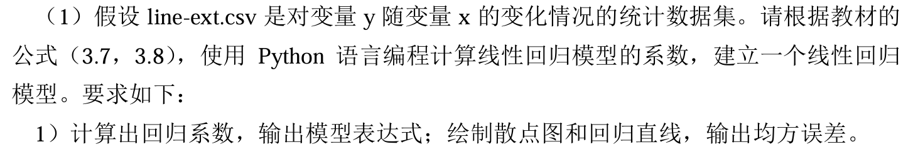

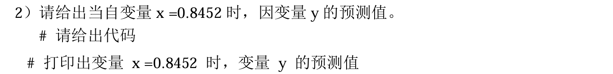

### 决策树算法实验

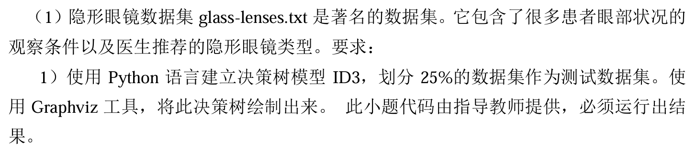

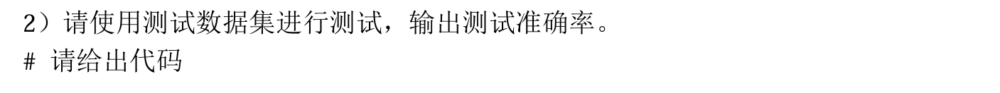

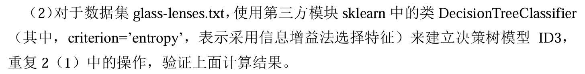

### 多元线性回归模型实验

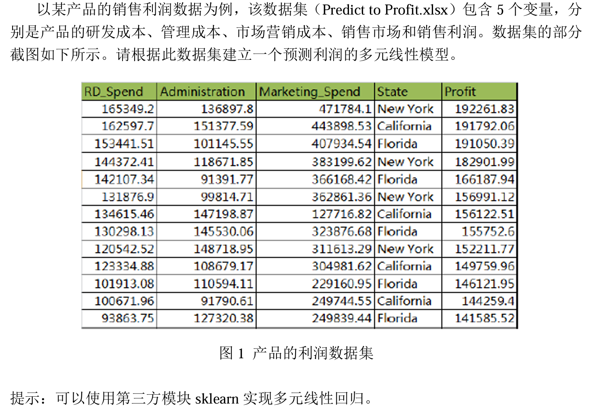

## 神经网络

### 标准与累积BP算法

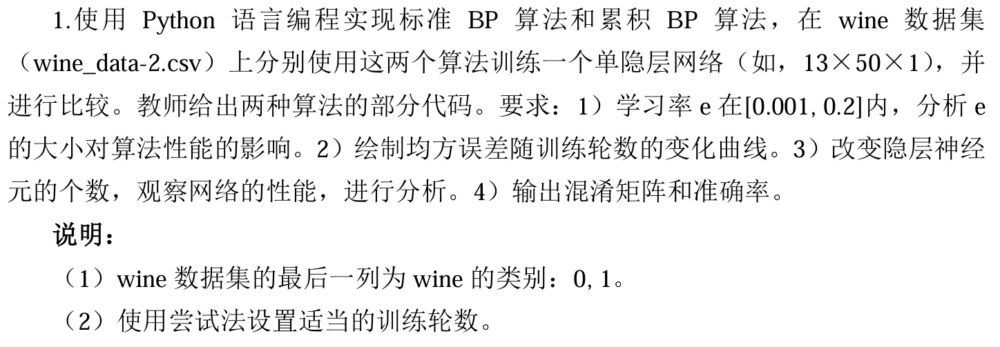

### 简单神经网络

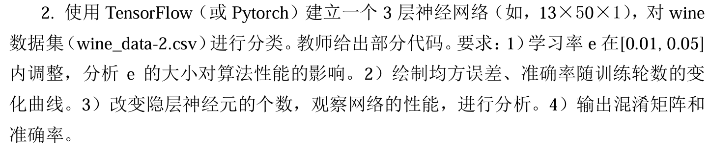

### CNN-MNIST

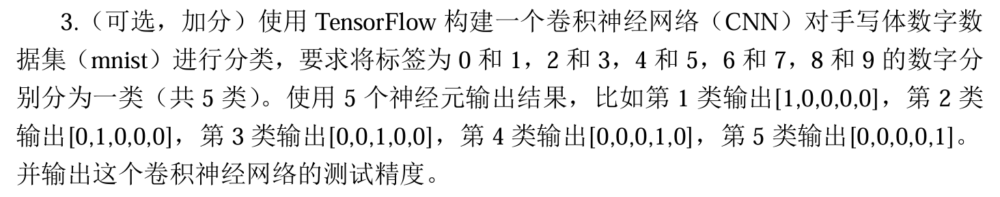

## 支持向量机

### 医学

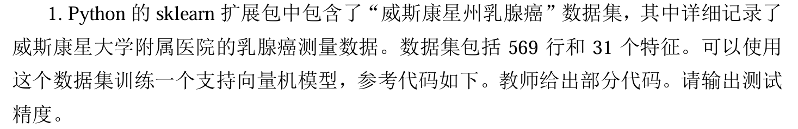

### 员工流失预测

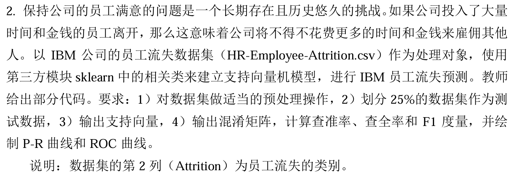

### 手写字母识别

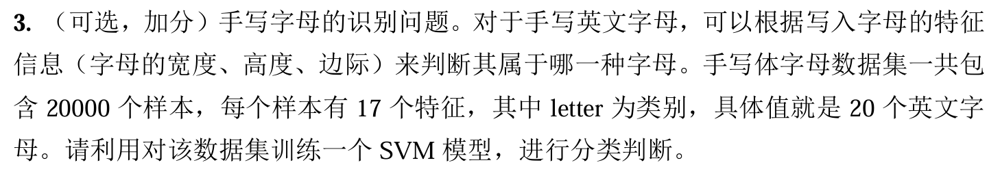

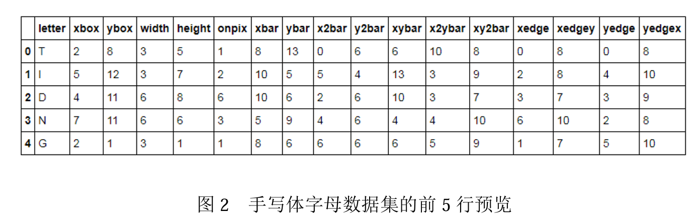

## 集成学习

### AdaBoost

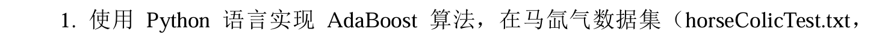

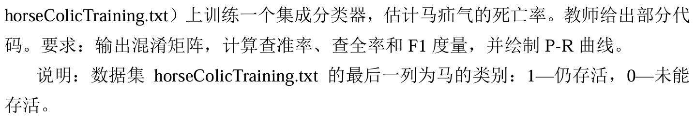

### 随机森林

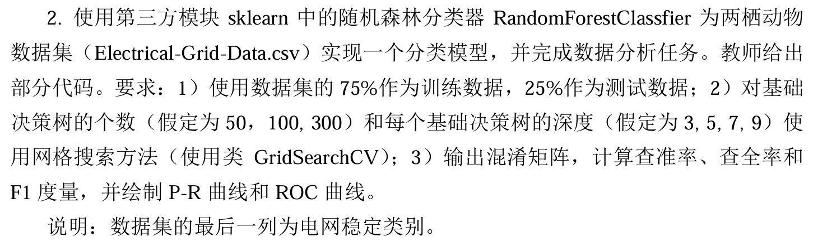

### UCI网站分类模型

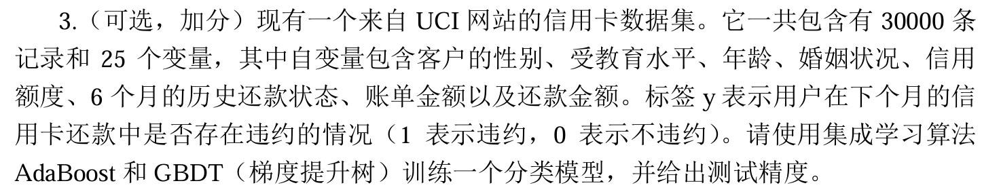